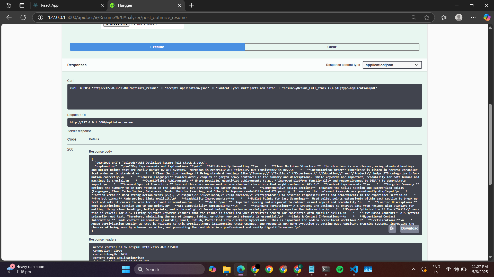
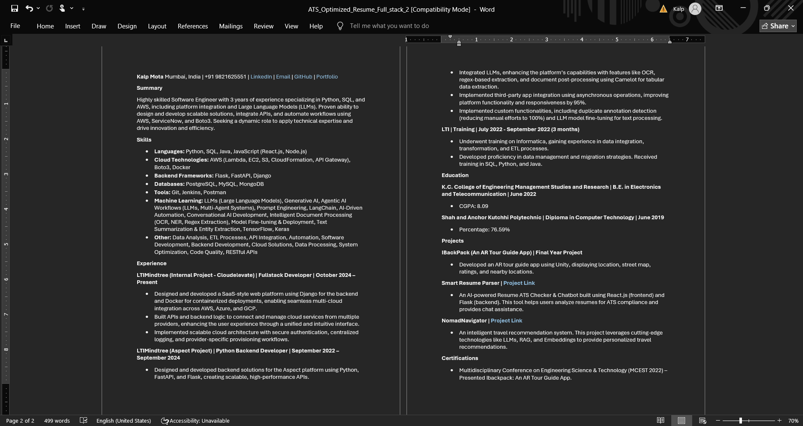

# 🚀 Smart-Resume-Parser

An AI-powered **Resume ATS Checker & Chatbot** built using **React.js (frontend)** and **Flask (backend)**.  
This tool helps users **analyze resumes for ATS compliance** and **provides chat assistance**.

## 📝 Features
✅ **Extract Resume Text** from PDF & DOCX  
✅ **Check ATS Compatibility** (Keywords, Formatting, Readability)  
✅ **Optimize Resume** using AI  
✅ **Generate ATS-Friendly Resume (DOCX/PDF)**  
✅ **Detect External Links and info from AI**
✅ **AI Chatbot using Vector DB**  

## 📸 Demo

### Optimize Resume



## 🎥 Video Walkthrough

### Resume Data Extraction
https://github.com/user-attachments/assets/3f322655-2265-45b2-802c-7ae04b110850

### Resume Analysis with Job Description
https://github.com/user-attachments/assets/50815034-1008-4f51-9d6d-dfca8b13af19

### ATS score checker and chatbot
https://github.com/user-attachments/assets/bdc3e27c-99b0-47c4-9677-44424e044634

## ⚙️ Tech Stack
### **Frontend (React.js)**
- **React + Tailwind CSS** (for UI)  
- **Axios** (for API requests)  
- **File Upload** (for resume submission)  
- **ShadCN & Framer Motion** (for animations)
  
### **Backend (Flask)**
- **Python** (Flask)
- **LLM Models** (Gemini, Llama)
- **PyMuPDF (Fitz)** - PDF Parsing
- **docx** - Extracting DOCX text
- **Markdown & JSON** for structured data

## 🚀 Installation & Usage
### 1️⃣ Clone the Repo  
```bash
git clone https://github.com/kalp12/Smart-Resume-Parser.git
cd Smart-Resume-Parser
```

### 2️⃣ Install Dependencies
```bash
pip install -r requirements.txt
```
### 3️⃣ Run the App
```bash
python app.py
```

## Frontend (React.js) Setup
```bash
cd frontend
npm install  # Install dependencies
npm start  # Run React app
```

## 📂 API Endpoints
```plaintext
    Endpoint	            Method	     Description
    /upload_resume_ats	  POST	      Upload a resume file for ATS Score, checking, Formatting Issues, Missing Sections and Suggestions
    /optimize_resume	   POST	      Upload a resume file to get the optimized AI-enhanced resume in DOCX/PDF
    ​/upload_resume        POST        Upload a resume to get extracted text, links and info from AI
    ​/upload_resume_jd     POST        Upload a resume with Job Description to get analysis and provide feedback 
    ​/query                POST        Ask a question and get an AI-generated answer based on stored resumes
